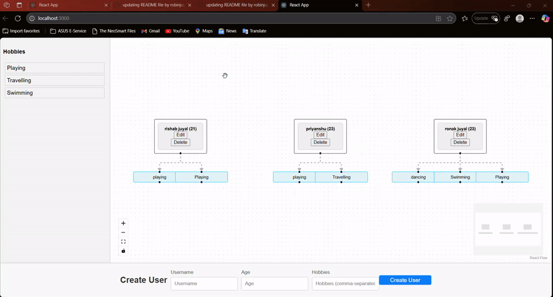
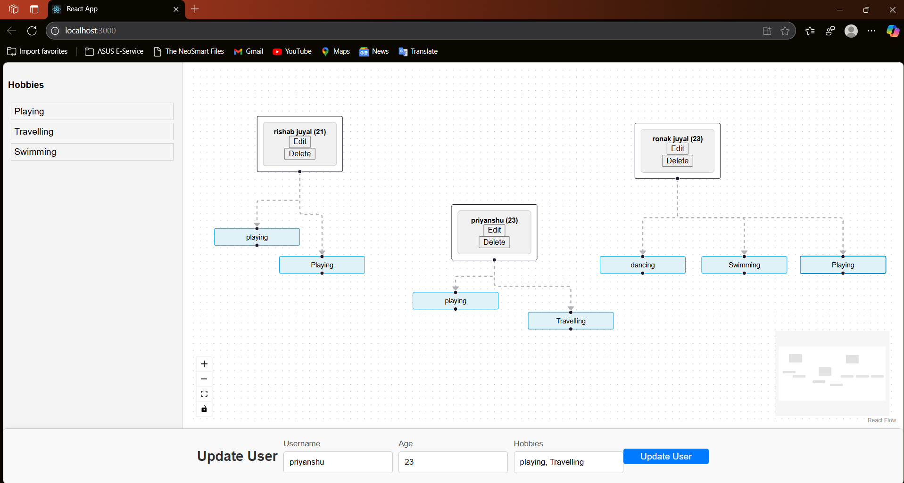
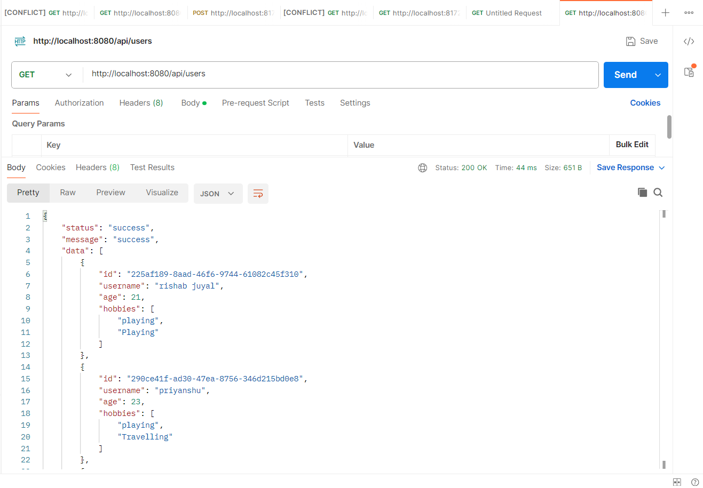
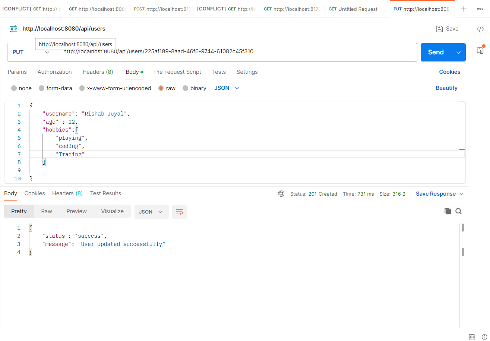

# Description

A full-stack application with Stringboot CRUD API backend using Mysql database, and a React frontend featuring interactive user visualization using react-flow

## Setup Instructions 

- Open the ums-backend folder to any code editor and run the project . Note - your computer must have Springboot already installed with proper setup.
- Database is handled by Mysql therefore it should be installed on your pc
- If properly done your Springboot application will start to run on port 8080 .
- Open the ums-frontend folder to any code editor and run - ' npm start '
- The frontend code will start to run on your localhost port 3000 (Your computer should have node and npm already installed).

## Features 

- Backend: RESTful APIs with CRUD operations
- Frontend: Interactive UI with drag-and-drop features
- Database: Mysql for storing user data
- Visualization: Users and their hobbies are displayed as nodes with `react-flow`


### Application.peroperites file Springboot :-

```

spring.application.name=UMS-backend
spring.datasource.url=jdbc:mysql://localhost:3306/testing
spring.datasource.username=root
spring.datasource.password= your password
spring.jpa.datasource.hibernate.dialect=org.hibernate.dialect.MySQL8Dialect
spring.jpa.hibernate.ddl-auto=update

```

## API documentation :-
```

 > GET "http://localhost:8080/api/users" >  api/users - get all users

 > POST "http://localhost:8080/api/users/" > api/users - create new user

 > PUT "http://localhost:8080/api/users/{userId}" > api/users/{userId} - update user

 > DELETE "http://localhost:8080/api/{userId}" > api/users/{userId} - delete user

```
## Frontend overview :-
- LIVE DEMO


- Preview : -


## Backend overview :-
- Test cases :
  Get all users >>>
  

  Update user >>>
  
  


# Author 
## Robin Juyal | robinjuyal29@gmail.com | 9548933347


